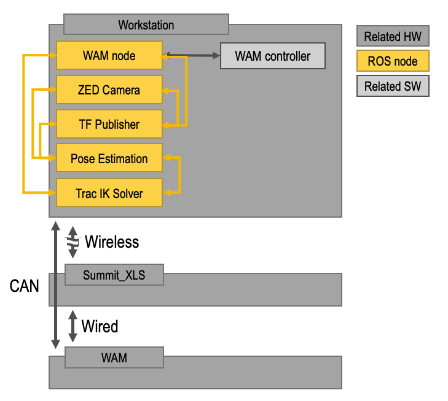
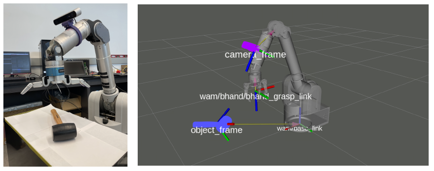

### arl-affpose-ros-node

I used arl-affpose-ros-node with the following repos:

1. [LabelFusion](https://github.com/RobotLocomotion/LabelFusion) for generating real images.
2. [NDDS](https://github.com/NVIDIA/Dataset_Synthesizer) for generating synthetic images.
3. [arl-affpose-dataset-utils](https://github.com/UW-Advanced-Robotics-Lab/arl-affpose-dataset-utils) a custom dataset that I generated.
4. [pytorch-simple-affnet](https://github.com/UW-Advanced-Robotics-Lab/pytorch-simple-affnet) for predicting an object affordance labels.
5. [densefusion](https://github.com/UW-Advanced-Robotics-Lab) for predicting an object 6-DoF pose.
6. [barrett-wam-arm](https://github.com/UW-Advanced-Robotics-Lab/barrett-wam-arm) for robotic grasping experiments. Specifically barrett_tf_publisher and barrett_trac_ik. 

### ROS Architecture
Here is an overview of our Architecture.


### Object Pose for Grasping

There are four main coordinate frames are used to grasp an object: 
1. base link of the manipulator
2. camera frame
3. object frame
4. end effector frame

Note that the camera frame is a dynamic transform as we mounted our camera on our arm. See [barrett_tf_publisher](https://github.com/UW-Advanced-Robotics-Lab/barrett-wam-arm/tree/main/barrett_tf_publisher).

Note the object frame was determined either using marker-based methods, such as [aruco_ros](https://github.com/pal-robotics/aruco_ros), or using deep learning, such as [DOPE](https://github.com/NVlabs/Deep_Object_Pose) or [DenseFusion](https://github.com/j96w/DenseFusion).
    
Note that we used a 8-DoF Barrett Hand for the end effector frame. Which has +/- 17.5cm from tip to the center of the palm. Note that two-finger grippers require the object pose to be accurate within +/- 2cm.



### Packages
* Ubuntu 18.04
* Cuda 10.0
* Python 2.7: 'conda create --name AFFDFROSNode python=2.7'
* Pytorch 1.4: 'conda install pytorch==1.4.0 torchvision==0.5.0 cudatoolkit=10.0 -c pytorch'

### Requirements
   ```
   $ conda env create -f environment.yml --name AFFDFROSNode
   ```
